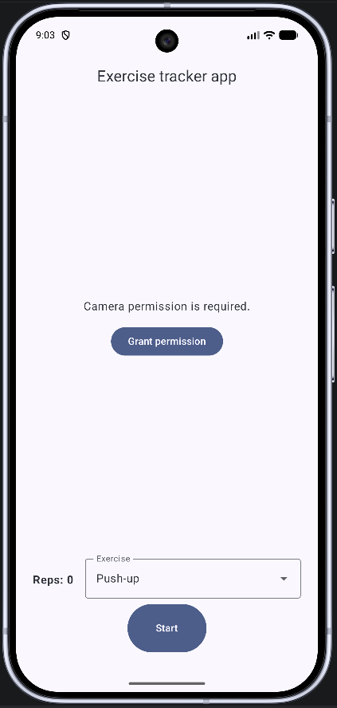
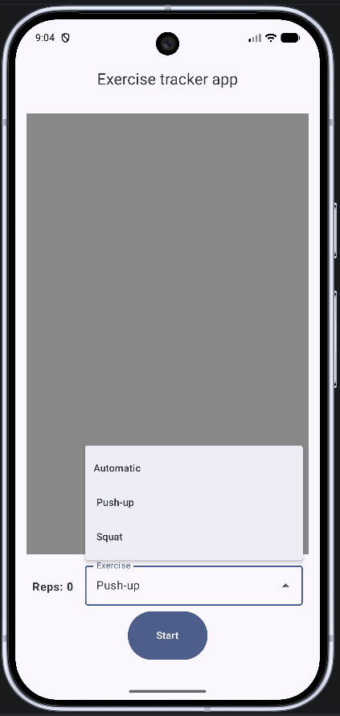
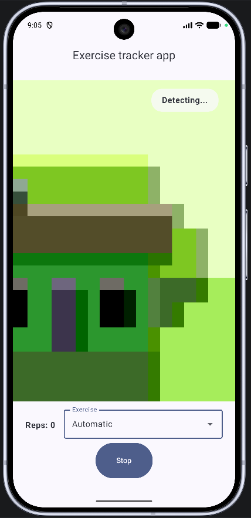

# Exercise Tracker

Exercise Tracker is an Android application that uses the device camera and pose
estimation to count exercise repetitions in real time. It is built as a practical
exploration of CameraX, MediaPipe, Jetpack Compose, and pose-based movement
detection.

The project currently recognizes push-ups and squats. A user can select an
exercise manually or let the app estimate the exercise from their body position.

## Features

- Live front-camera preview using CameraX
- On-device pose landmark detection with MediaPipe
- Push-up counting based on elbow movement
- Squat counting based on knee movement
- Manual and automatic exercise selection
- Landmark visibility checks to avoid counting unreliable poses
- Real-time repetition count displayed in a Compose UI
- Unit-tested pose math, classification, and repetition state machines

## Screenshots

<table>
  <tr>
    <th>Camera Permission</th>
    <th>Exercise Modes</th>
    <th>Pose Tracking</th>
  </tr>
  <tr>
    <td></td>
    <td></td>
    <td></td>
  </tr>
</table>

## How It Works

1. CameraX provides frames from the front-facing camera.
2. MediaPipe converts each frame into body landmarks.
3. The landmarks are mapped to a smaller `BodyPose` model containing the joints
   needed by the app.
4. An exercise detector calculates joint angles and tracks movement between
   states such as `UP` and `DOWN`.
5. A repetition is counted after a complete movement, for example from the down
   position of a push-up back to the up position.

The exercise detectors use separate thresholds for entering and leaving a
position. This prevents a repetition from being counted repeatedly while the
user remains in the same position.

## Tech Stack

- Kotlin
- Jetpack Compose and Material 3
- CameraX
- MediaPipe Pose Landmarker
- ViewModel and StateFlow
- Manual dependency injection through an application container
- JUnit 4

## Project Structure

```text
camera/       CameraX setup and frame analysis
data/         Application-level dependencies
exercise/     Exercise classifiers, detectors, results, and state machines
model/        Arm and leg models
pose/         Body landmarks, visibility selection, and angle calculations
ui/           Compose screens, UI state, and ViewModel
```

The camera and MediaPipe code are kept separate from the exercise rules. Most of
the counting logic is plain Kotlin, so it can be tested without a camera or an
Android device.

## Running the App

Requirements:

- Android Studio with a compatible Android SDK
- Android 7.0 or newer (`minSdk 24`)
- A device or emulator with a camera

Open the project in Android Studio, allow Gradle to finish syncing, and run the
`app` configuration. Grant camera permission when prompted. A physical device is
recommended for testing movement and pose detection.

The Lite MediaPipe pose model is already included in the app assets, so no model
download is required at runtime.

## Tests

The unit tests cover joint-angle calculations, limb visibility, exercise
classification, and complete push-up and squat transitions.

Run them with:

```shell
./gradlew testDebugUnitTest
```

On Windows:

```powershell
.\gradlew.bat testDebugUnitTest
```

## Project Status

This project is still in development. The current focus is reliable real-time
exercise detection rather than workout history or account features.

Possible future improvements include smoothing noisy pose results, stabilizing
automatic exercise classification, adding form feedback, and supporting more
exercise types.
